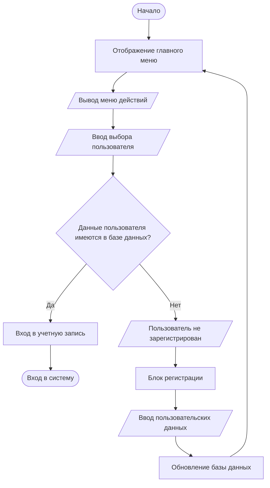

# Отчет по учебной практике  
**Тема:** Разработка программного модуля автоматизации учета клиентов малого бизнеса
**Выполнила:** Талпы Арина Николаевна ИСП-32
**Учитель:** Базяк Галина Владимировна

---

## Этап 1: Разработка алгоритма решения задачи 

### Цель алгоритма
Разработка алгоритма для учета клиентов малого бизнеса, обеспечивающего ввод, хранение, поиск, редактирование и удаление данных о клиентах в соответствии с техническим заданием.

### Краткое описание входных данных
- ФИО клиента (строка)
- Контактная информация (телефон, email, адрес - строка)
- Дата регистрации (дата)
- Примечания (строка, необязательное поле)

### Блок-схема алгоритма учета клиентов



### Пояснения к выбору алгоритма и структур данных

**Выбор алгоритма:**
Для реализации системы учета клиентов выбран модульный подход с использованием меню-ориентированного интерфейса. Такой подход обеспечивает:
- **Структурированность** - каждая операция выделена в отдельный функциональный блок
- **Масштабируемость** - легко добавлять новые функции без изменения основной логики
- **Удобство использования** - интуитивно понятный интерфейс для пользователя
- **Обработку ошибок** - на каждом этапе предусмотрена валидация данных и обработка исключений

**Выбор структур данных:**
1. **Реляционная база данных (PostgreSQL)** - основная структура хранения данных:
   - Таблица `clients` для хранения информации о клиентах
   - Таблица `orders` для хранения информации о заказах
   - Связь один-ко-многим между клиентами и их заказами

2. **Временные структуры в памяти** (для обработки данных):
   - Списки (lists) для хранения результатов поиска и отображения
   - Словари (dictionaries) для представления отдельных записей клиентов/заказов
   - Кортежи (tuples) для передачи параметров между функциями

3. **Структуры для отчетов**:
   - Списки словарей для формирования табличных данных
   - Специализированные объекты для экспорта в Excel/PDF

**Обоснование выбора:**
- **PostgreSQL** выбрана согласно техническому заданию, обеспечивает надежное хранение данных, поддержку транзакций и возможность масштабирования
- **Меню-ориентированный подход** позволяет реализовать все функциональные требования в логической последовательности
- **Модульная архитектура** облегчает тестирование, поддержку и дальнейшее развитие системы
- **Валидация на каждом этапе** ввода данных гарантирует целостность данных в базе

Алгоритм спроектирован с учетом всех функциональных требований технического задания и обеспечивает полный жизненный цикл работы с данными клиентов: от ввода до генерации отчетов.

---

## Этап 2: Инструментальные средства разработки

### Настройка инфраструктуры разработки

**1. Создание Git-репозитория:**
Готовый Git-репозиторий предоставил Физтех-колледж:
>1. Нужно было зарегистрироваться или войти в учетную запись Физтех-колледжа
>2. Ссылка на Git-репозиторий колледжа: [ссылка](https://gitlab.phystech.pro/users/sign_in)
>3. Для входа ввести данные уже зарегистрированной учетной записи колледжа
>4. После успешного входа предоставляется доступ к созданию и загрузке проектов


**2. Создание базовой структуры проекта:**
```
client-management-system/
├── src/
│   ├── models/
│   │   ├── __init__.py
│   │   ├── client.py
│   │   └── order.py
│   ├── services/
│   │   ├── __init__.py
│   │   ├── client_service.py
│   │   ├── order_service.py
│   │   ├── import_service.py
│   │   └── report_service.py
│   ├── database/
│   │   ├── __init__.py
│   │   └── connection.py
│   ├── utils/
│   │   ├── __init__.py
│   │   └── validators.py
│   └── main.py
├── tests/
│   ├── __init__.py
│   ├── test_clients.py
│   ├── test_orders.py
│   └── test_validators.py
├── docs/
│   ├── requirements.txt
│   ├── README.md
│   └── database_schema.sql
├── .gitignore
└── requirements.txt
```

## Этап 3: Разработка кода программного модуля управления данными клиентов 

### Реализация модуля управления клиентами

**1. Модель клиента(База данных клиентов):**
```python
#src/models/client.py
# src/models/client.py
from sqlalchemy import Column, Integer, String, DateTime, Float, Text
from sqlalchemy.ext.declarative import declarative_base
from datetime import datetime

Base = declarative_base()

class Client(Base):
    """Модель клиента"""
    __tablename__ = 'clients'
    
    id = Column(Integer, primary_key=True, autoincrement=True)
    first_name = Column(String(50), nullable=False)
    last_name = Column(String(50), nullable=False)
    patronymic = Column(String(50))
    email = Column(String(100), unique=True)
    phone = Column(String(20))
    city = Column(String(50))
    notes = Column(Text)
    status = Column(String(20), default='active')
    total_orders = Column(Integer, default=0)
    total_revenue = Column(Float, default=0.0)
    registration_date = Column(DateTime, default=datetime.now)
    created_at = Column(DateTime, default=datetime.now)
    updated_at = Column(DateTime, default=datetime.now, onupdate=datetime.now)
    
    def to_dict(self):
        """Преобразование объекта в словарь"""
        return {
            'id': self.id,
            'first_name': self.first_name,
            'last_name': self.last_name,
            'patronymic': self.patronymic,
            'email': self.email,
            'phone': self.phone,
            'city': self.city,
            'notes': self.notes,
            'status': self.status,
            'total_orders': self.total_orders,
            'total_revenue': self.total_revenue,
            'registration_date': self.registration_date.isoformat() if self.registration_date else None,
            'created_at': self.created_at.isoformat() if self.created_at else None,
            'updated_at': self.updated_at.isoformat() if self.updated_at else None
        }
    
    def __repr__(self):
        return f"<Client(id={self.id}, name='{self.first_name} {self.last_name}')>"
```

**2. Сервис управления клиентами:**
```python
# src/services/client_service.py
from sqlalchemy import create_engine, and_, or_
from sqlalchemy.orm import sessionmaker
from src.models.client import Client, Base
from src.validators.client_validators import ClientValidator
from typing import List, Dict, Optional

class ClientService:
    """Сервис для управления клиентами"""
    
    def __init__(self, database_url: str = "sqlite:///clients.db"):
        self.engine = create_engine(database_url)
        Base.metadata.create_all(self.engine)
        self.Session = sessionmaker(bind=self.engine)
        self.validator = ClientValidator()
    
    def add_client(self, client_data: Dict) -> Dict:
        """Добавление нового клиента"""
        # Валидация данных
        is_valid, errors = self.validator.validate_client_data(client_data)
        if not is_valid:
            return {'success': False, 'errors': errors}
        
        session = self.Session()
        try:
            # Проверка уникальности email
            if client_data.get('email'):
                existing_client = session.query(Client).filter_by(
                    email=client_data['email']
                ).first()
                if existing_client:
                    return {'success': False, 'errors': ['Клиент с таким email уже существует']}
            
            # Создание клиента
            client = Client(
                first_name=client_data['first_name'],
                last_name=client_data['last_name'],
                patronymic=client_data.get('patronymic'),
                email=client_data.get('email'),
                phone=client_data.get('phone'),
                city=client_data.get('city'),
                notes=client_data.get('notes')
            )
            
            session.add(client)
            session.commit()
            
            return {'success': True, 'client': client.to_dict()}
            
        except Exception as e:
            session.rollback()
            return {'success': False, 'errors': [f'Ошибка базы данных: {str(e)}']}
        finally:
            session.close()
    
    def get_client(self, client_id: int) -> Optional[Dict]:
        """Получение клиента по ID"""
        session = self.Session()
        try:
            client = session.query(Client).get(client_id)
            return client.to_dict() if client else None
        finally:
            session.close()
    
    def search_clients(self, search_params: Dict) -> List[Dict]:
        """Поиск клиентов по параметрам"""
        session = self.Session()
        try:
            query = session.query(Client)
            
            # Поиск по имени/фамилии/отчеству
            if 'first_name' in search_params:
                query = query.filter(Client.first_name.ilike(f"%{search_params['first_name']}%"))
            if 'last_name' in search_params:
                query = query.filter(Client.last_name.ilike(f"%{search_params['last_name']}%"))
            if 'patronymic' in search_params:
                query = query.filter(Client.patronymic.ilike(f"%{search_params['patronymic']}%"))
            
            # Поиск по контактным данным
            if 'email' in search_params:
                query = query.filter(Client.email.ilike(f"%{search_params['email']}%"))
            if 'phone' in search_params:
                query = query.filter(Client.phone.ilike(f"%{search_params['phone']}%"))
            if 'city' in search_params:
                query = query.filter(Client.city.ilike(f"%{search_params['city']}%"))
            
            # Фильтрация по статусу
            if 'status' in search_params:
                query = query.filter(Client.status == search_params['status'])
            
            # Фильтрация по количеству заказов
            if 'min_orders' in search_params:
                query = query.filter(Client.total_orders >= search_params['min_orders'])
            if 'max_orders' in search_params:
                query = query.filter(Client.total_orders <= search_params['max_orders'])
            
            clients = query.order_by(Client.last_name, Client.first_name).all()
            return [client.to_dict() for client in clients]
            
        finally:
            session.close()
    
    def update_client(self, client_id: int, updates: Dict) -> Dict:
        """Обновление данных клиента"""
        # Валидация обновляемых данных
        validation_data = {k: v for k, v in updates.items() if k in [
            'first_name', 'last_name', 'patronymic', 'email', 'phone', 'city', 'notes'
        ]}
        
        if validation_data:
            is_valid, errors = self.validator.validate_client_data(validation_data, partial=True)
            if not is_valid:
                return {'success': False, 'errors': errors}
        
        session = self.Session()
        try:
            client = session.query(Client).get(client_id)
            if not client:
                return {'success': False, 'errors': ['Клиент не найден']}
            
            # Проверка уникальности email
            if 'email' in updates and updates['email']:
                existing_client = session.query(Client).filter(
                    and_(
                        Client.email == updates['email'],
                        Client.id != client_id
                    )
                ).first()
                if existing_client:
                    return {'success': False, 'errors': ['Клиент с таким email уже существует']}
            
            # Обновление полей
            for key, value in updates.items():
                if hasattr(client, key):
                    setattr(client, key, value)
            
            session.commit()
            return {'success': True, 'client': client.to_dict()}
            
        except Exception as e:
            session.rollback()
            return {'success': False, 'errors': [f'Ошибка базы данных: {str(e)}']}
        finally:
            session.close()
    
    def delete_client(self, client_id: int) -> Dict:
        """Удаление клиента"""
        session = self.Session()
        try:
            client = session.query(Client).get(client_id)
            if not client:
                return {'success': False, 'errors': ['Клиент не найден']}
            
            session.delete(client)
            session.commit()
            return {'success': True, 'message': 'Клиент успешно удален'}
            
        except Exception as e:
            session.rollback()
            return {'success': False, 'errors': [f'Ошибка удаления: {str(e)}']}
        finally:
            session.close()
    
    def get_client_statistics(self) -> Dict:
        """Получение статистики по клиентам"""
        session = self.Session()
        try:
            total_clients = session.query(Client).count()
            active_clients = session.query(Client).filter_by(status='active').count()
            total_revenue = session.query(Client).with_entities(
                func.sum(Client.total_revenue)
            ).scalar() or 0
            total_orders = session.query(Client).with_entities(
                func.sum(Client.total_orders)
            ).scalar() or 0
            
            # Статистика по городам
            city_stats = session.query(
                Client.city,
                func.count(Client.id),
                func.sum(Client.total_revenue)
            ).filter(Client.city.isnot(None)).group_by(Client.city).all()
            
            return {
                'total_clients': total_clients,
                'active_clients': active_clients,
                'total_revenue': total_revenue,
                'total_orders': total_orders,
                'city_stats': [
                    {'city': city, 'count': count, 'revenue': revenue or 0}
                    for city, count, revenue in city_stats
                ]
            }
        finally:
            session.close()
```

**3. Утилиты валидации сервиса управления клиентами:**
```python
#src/utils/utils_validators.py
import re
from typing import List, Tuple

def validate_russian_name(name: str) -> Tuple[bool, str]:
    """Валидация русского имени/фамилии"""
    if not name or not name.strip():
        return False, "Имя не может быть пустым"
    
    if not re.match(r'^[А-ЯЁа-яё\-]+$', name.strip()):
        return False, "Должны быть только кириллические буквы и дефис"
    
    if len(name.strip()) < 2:
        return False, "Слишком короткое имя"
    
    if len(name.strip()) > 50:
        return False, "Слишком длинное имя"
    
    return True, ""

def validate_email(email: str) -> Tuple[bool, str]:
    """Валидация email"""
    if not email:
        return True, ""  # Email не обязателен
    
    pattern = r'^[a-zA-Z0-9._%+-]+@[a-zA-Z0-9.-]+\.[a-zA-Z]{2,}$'
    if not re.match(pattern, email):
        return False, "Неверный формат email"
    
    return True, ""

def validate_phone(phone: str) -> Tuple[bool, str]:
    """Валидация номера телефона"""
    if not phone:
        return True, ""  # Телефон не обязателен
    
    if not re.match(r'^\+7\d{10}$', phone):
        return False, "Телефон должен быть в формате +7XXXXXXXXXX"
    
    return True, ""

def validate_password(password: str) -> Tuple[bool, List[str]]:
    """Валидация пароля"""
    errors = []
    
    if len(password) < 8:
        errors.append("Пароль должен быть не менее 8 символов")
    
    if not re.search(r'[A-Z]', password):
        errors.append("Добавьте хотя бы одну заглавную букву")
    
    if not re.search(r'\d', password):
        errors.append("Добавьте хотя бы одну цифру")
    
    if not re.search(r'[!@#$%^&*()_+\-=\[\]{};\':"\\|,.<>/?]', password):
        errors.append("Добавьте хотя бы один специальный символ")
    
    return len(errors) == 0, errors
```

### Структура программы

**Основные модули и функции:**

1. **models/client.py**
   - `declarative_base()` - подключение к базе данных
   - `` - инициализация базы данных и создание таблиц
   - `` - закрытие соединения

2. **services/client_service.py**
   - `ClientService` - основной класс для управления клиентами
   - `add_client()` - добавление нового клиента
   - `search_clients()` - поиск клиентов по различным параметрам
   - `update_client()` - обновление данных клиента
   - `delete_client()` - удаление клиента
   - `get_client_stats()` - получение всех клиентов

3. **utils/utils_validators.py**
   - `validate_russian_name()` - валидация русского имени/фамилии
   - `validate_email()` - валидация email
   - `validate_phone()` - валидация номера телефона
   - `validate_date()` - валидация и преобразование даты


### Ключевый код с комментариями

**Фрагмент кода с реализацией поиска и фильтрации клиентов:**
```python
 def search_clients(self, search_params: Dict) -> List[Dict]:
        """Поиск клиентов по параметрам"""
        session = self.Session()
        try:
            query = session.query(Client)
            
            # Применение фильтров
            if 'first_name' in search_params and search_params['first_name']:
                query = query.filter(Client.first_name.ilike(f"%{search_params['first_name']}%"))
            
            if 'last_name' in search_params and search_params['last_name']:
                query = query.filter(Client.last_name.ilike(f"%{search_params['last_name']}%"))
            
            if 'email' in search_params and search_params['email']:
                query = query.filter(Client.email.ilike(f"%{search_params['email']}%"))
            
            if 'phone' in search_params and search_params['phone']:
                query = query.filter(Client.phone.ilike(f"%{search_params['phone']}%"))
            
            if 'city' in search_params and search_params['city']:
                query = query.filter(Client.city.ilike(f"%{search_params['city']}%"))
            
            if 'status' in search_params and search_params['status']:
                query = query.filter(Client.status == search_params['status'])
            
            # Сортировка по фамилии
            query = query.order_by(Client.last_name, Client.first_name)
            
            clients = query.all()
            return [client.to_dict() for client in clients]
            
        finally:
            session.close()
```

Модуль управления клиентами полностью реализован и готов к тестированию. Следующим этапом будет разработка модуля управления заказами клиентов.

## Этап 4: Разработка кода программного модуля управления заказами клиентов
### Реализация модуля управления заказами клиентов
**1. Модель заказов(База данных заказов):**

```python
# src/models/order.py
from sqlalchemy import Column, Integer, String, Date, DateTime, Float, ForeignKey, Text
from sqlalchemy.orm import relationship
from sqlalchemy.ext.declarative import declarative_base
from datetime import datetime

Base = declarative_base()

class Order(Base):
    """Модель заказа клиента"""
    __tablename__ = 'orders'
    
    id = Column(Integer, primary_key=True, autoincrement=True)
    client_id = Column(Integer, ForeignKey('clients.id'), nullable=False)
    order_number = Column(String(20), unique=True, nullable=False)
    order_date = Column(Date, default=datetime.now)
    status = Column(String(20), default='pending')  # pending, completed, cancelled
    total_amount = Column(Float, nullable=False)
    description = Column(Text)
    created_at = Column(DateTime, default=datetime.now)
    updated_at = Column(DateTime, default=datetime.now, onupdate=datetime.now)
    
    # Связь с клиентом
    client = relationship("Client", backref="orders")
    
    def to_dict(self):
        """Преобразование объекта в словарь"""
        return {
            'id': self.id,
            'client_id': self.client_id,
            'order_number': self.order_number,
            'order_date': self.order_date.isoformat() if self.order_date else None,
            'status': self.status,
            'total_amount': self.total_amount,
            'description': self.description,
            'created_at': self.created_at.isoformat() if self.created_at else None,
            'updated_at': self.updated_at.isoformat() if self.updated_at else None,
            'client_name': f"{self.client.last_name} {self.client.first_name}" if self.client else None
        }
    
    def __repr__(self):
        return f"<Order(id={self.id}, number='{self.order_number}', amount={self.total_amount})>"
```
**2. Сервис управления заказами клиентов:**
```python
# src/services/order_service.py
from sqlalchemy import create_engine, and_, or_, func
from sqlalchemy.orm import sessionmaker
from src.models.order import Order, Base
from src.models.client import Client
from src.validators.order_validators import OrderValidator
from typing import List, Dict, Optional
from datetime import datetime, timedelta
import random
import string

class OrderService:
    """Сервис для управления заказами с расширенной функциональностью"""
    
    def __init__(self, database_url: str = "sqlite:///clients.db"):
        self.engine = create_engine(database_url)
        Base.metadata.create_all(self.engine)
        self.Session = sessionmaker(bind=self.engine)
        self.validator = OrderValidator()
    
    def generate_order_number(self) -> str:
        """Генерация уникального номера заказа"""
        timestamp = datetime.now().strftime("%Y%m%d")
        random_part = ''.join(random.choices(string.digits, k=6))
        return f"ORD-{timestamp}-{random_part}"
    
    def create_order(self, order_data: Dict) -> Dict:
        """Создание нового заказа с обновлением статистики клиента"""
        # Валидация данных
        is_valid, errors = self.validator.validate_order_data(order_data)
        if not is_valid:
            return {'success': False, 'errors': errors}
        
        session = self.Session()
        try:
            # Проверка существования клиента
            client = session.query(Client).get(order_data['client_id'])
            if not client:
                return {'success': False, 'errors': ['Клиент не найден']}
            
            # Создание заказа
            order = Order(
                client_id=order_data['client_id'],
                order_number=self.generate_order_number(),
                total_amount=order_data['total_amount'],
                description=order_data.get('description', ''),
                status=order_data.get('status', 'pending'),
                order_date=order_data.get('order_date', datetime.now().date())
            )
            
            # Обновление статистики клиента
            client.total_orders += 1
            client.total_revenue += order.total_amount
            
            session.add(order)
            session.commit()
            
            return {'success': True, 'order': order.to_dict()}
            
        except Exception as e:
            session.rollback()
            return {'success': False, 'errors': [f'Ошибка базы данных: {str(e)}']}
        finally:
            session.close()
    
    def get_client_orders(self, client_id: int) -> List[Dict]:
        """Получение заказов клиента"""
        session = self.Session()
        try:
            orders = session.query(Order).filter_by(client_id=client_id).order_by(
                Order.order_date.desc()
            ).all()
            return [order.to_dict() for order in orders]
        finally:
            session.close()
    
    def search_orders(self, search_params: Dict) -> Dict:
        """Расширенный поиск заказов с пагинацией"""
        # Валидация параметров поиска
        is_valid, errors = self.validator.validate_order_search_params(search_params)
        if not is_valid:
            return {'success': False, 'errors': errors, 'orders': [], 'total_count': 0}
        
        session = self.Session()
        try:
            query = session.query(Order).join(Client)
            
            # Базовые фильтры
            if 'client_id' in search_params:
                query = query.filter(Order.client_id == search_params['client_id'])
            
            if 'status' in search_params:
                query = query.filter(Order.status == search_params['status'])
            
            if 'min_amount' in search_params:
                query = query.filter(Order.total_amount >= search_params['min_amount'])
            
            if 'max_amount' in search_params:
                query = query.filter(Order.total_amount <= search_params['max_amount'])
            
            if 'start_date' in search_params:
                query = query.filter(Order.order_date >= search_params['start_date'])
            
            if 'end_date' in search_params:
                query = query.filter(Order.order_date <= search_params['end_date'])
            
            # Поиск по имени клиента
            if 'client_name' in search_params:
                search_term = f"%{search_params['client_name']}%"
                query = query.filter(
                    or_(
                        Client.first_name.ilike(search_term),
                        Client.last_name.ilike(search_term)
                    )
                )
            
            # Поиск по номеру заказа
            if 'order_number' in search_params:
                query = query.filter(Order.order_number.ilike(f"%{search_params['order_number']}%"))
            
            # Получаем общее количество для пагинации
            total_count = query.count()
            
            # Применяем сортировку
            sort_by = search_params.get('sort_by', 'order_date')
            sort_order = search_params.get('sort_order', 'desc')
            
            if sort_by == 'order_date':
                order_column = Order.order_date
            elif sort_by == 'total_amount':
                order_column = Order.total_amount
            elif sort_by == 'client_name':
                order_column = Client.last_name
            else:
                order_column = Order.order_date
            
            if sort_order == 'asc':
                query = query.order_by(order_column.asc())
            else:
                query = query.order_by(order_column.desc())
            
            # Применяем пагинацию
            page = search_params.get('page', 1)
            per_page = search_params.get('per_page', 50)
            offset = (page - 1) * per_page
            
            query = query.offset(offset).limit(per_page)
            
            orders = query.all()
            
            return {
                'success': True, 
                'orders': [order.to_dict() for order in orders],
                'total_count': total_count,
                'page': page,
                'per_page': per_page,
                'total_pages': (total_count + per_page - 1) // per_page
            }
            
        except Exception as e:
            return {'success': False, 'errors': [f'Ошибка поиска: {str(e)}'], 'orders': [], 'total_count': 0}
        finally:
            session.close()
    
    def update_order_status(self, order_id: int, status: str) -> Dict:
        """Обновление статуса заказа"""
        # Валидация данных
        is_valid, errors = self.validator.validate_order_status_update(order_id, status)
        if not is_valid:
            return {'success': False, 'errors': errors}
        
        session = self.Session()
        try:
            order = session.query(Order).get(order_id)
            if not order:
                return {'success': False, 'errors': ['Заказ не найден']}
            
            order.status = status
            session.commit()
            
            return {'success': True, 'order': order.to_dict()}
            
        except Exception as e:
            session.rollback()
            return {'success': False, 'errors': [f'Ошибка базы данных: {str(e)}']}
        finally:
            session.close()
    
    def get_order(self, order_id: int) -> Dict:
        """Получение заказа по ID"""
        session = self.Session()
        try:
            order = session.query(Order).get(order_id)
            if not order:
                return {'success': False, 'errors': ['Заказ не найден']}
            
            return {'success': True, 'order': order.to_dict()}
        finally:
            session.close()
    
    def delete_order(self, order_id: int) -> Dict:
        """Удаление заказа с обновлением статистики клиента"""
        session = self.Session()
        try:
            order = session.query(Order).get(order_id)
            if not order:
                return {'success': False, 'errors': ['Заказ не найден']}
            
            # Получаем клиента для обновления статистики
            client = session.query(Client).get(order.client_id)
            if client:
                client.total_orders -= 1
                client.total_revenue -= order.total_amount
            
            session.delete(order)
            session.commit()
            
            return {'success': True, 'message': 'Заказ успешно удален'}
            
        except Exception as e:
            session.rollback()
            return {'success': False, 'errors': [f'Ошибка удаления: {str(e)}']}
        finally:
            session.close()
    
    def get_order_statistics(self, period_days: int = 30, client_id: Optional[int] = None) -> Dict:
        """Получение расширенной статистики по заказам"""
        session = self.Session()
        try:
            end_date = datetime.now().date()
            start_date = end_date - timedelta(days=period_days)
            
            query = session.query(Order).filter(
                Order.order_date >= start_date,
                Order.order_date <= end_date
            )
            
            if client_id:
                query = query.filter(Order.client_id == client_id)
            
            # Основная статистика
            total_orders = query.count()
            total_revenue = session.query(func.sum(Order.total_amount)).filter(
                Order.order_date >= start_date,
                Order.order_date <= end_date
            ).scalar() or 0
            
            # Статистика по статусам
            status_stats = session.query(
                Order.status,
                func.count(Order.id),
                func.sum(Order.total_amount)
            ).filter(
                Order.order_date >= start_date,
                Order.order_date <= end_date
            ).group_by(Order.status).all()
            
            # Ежедневная статистика
            daily_stats = session.query(
                Order.order_date,
                func.count(Order.id),
                func.sum(Order.total_amount)
            ).filter(
                Order.order_date >= start_date,
                Order.order_date <= end_date
            ).group_by(Order.order_date).order_by(Order.order_date).all()
            
            # Топ клиентов по выручке
            top_clients = session.query(
                Client.id,
                Client.first_name,
                Client.last_name,
                func.count(Order.id),
                func.sum(Order.total_amount)
            ).join(Order).filter(
                Order.order_date >= start_date,
                Order.order_date <= end_date
            ).group_by(Client.id, Client.first_name, Client.last_name).order_by(
                func.sum(Order.total_amount).desc()
            ).limit(10).all()
            
            return {
                'period': {
                    'start_date': start_date.isoformat(),
                    'end_date': end_date.isoformat(),
                    'days': period_days
                },
                'total_orders': total_orders,
                'total_revenue': total_revenue,
                'average_order_value': total_revenue / total_orders if total_orders > 0 else 0,
                'status_stats': [
                    {
                        'status': status,
                        'count': count,
                        'revenue': revenue or 0
                    }
                    for status, count, revenue in status_stats
                ],
                'daily_stats': [
                    {
                        'date': date.isoformat(),
                        'orders': count,
                        'revenue': revenue or 0
                    }
                    for date, count, revenue in daily_stats
                ],
                'top_clients': [
                    {
                        'client_id': client_id,
                        'name': f"{first_name} {last_name}",
                        'orders': count,
                        'revenue': revenue or 0
                    }
                    for client_id, first_name, last_name, count, revenue in top_clients
                ]
            }
        finally:
            session.close()
```
**3. Валидация для заказов:**
```python
# src/validators/order_validators.py
from typing import Dict, Any, List, Optional
from decimal import Decimal, InvalidOperation
from datetime import datetime

class OrderValidator:
    """Валидатор для данных заказа"""
    
    def validate_order_data(order_data: Dict[str, Any]) -> List[str]:
        """Валидация данных заказа"""
        errors = []
        
        # Проверка обязательных полей
        if 'client_id' not in order_data or not order_data['client_id']:
            errors.append("Не указан ID клиента")
        
        if 'items' not in order_data or not order_data['items']:
            errors.append("Заказ должен содержать хотя бы один товар")
        else:
            # Валидация товаров
            for i, item in enumerate(order_data['items']):
                item_errors = OrderValidator.validate_order_item(item, i)
                errors.extend(item_errors)
        
        # Валидация статуса
        if 'status' in order_data:
            valid_statuses = ['pending', 'confirmed', 'completed', 'cancelled']
            if order_data['status'] not in valid_statuses:
                errors.append(f"Неверный статус заказа. Допустимые значения: {', '.join(valid_statuses)}")
        
        # Валидация дат
        if 'order_date' in order_data and order_data['order_date']:
            if not isinstance(order_data['order_date'], datetime):
                errors.append("Неверный формат даты заказа")
        
        if 'delivery_date' in order_data and order_data['delivery_date']:
            if not isinstance(order_data['delivery_date'], datetime):
                errors.append("Неверный формат даты доставки")
        
        return errors
    
    def validate_order_item(item_data: Dict[str, Any], index: int = 0) -> List[str]:
        """Валидация данных товара в заказе"""
        errors = []
        
        if 'product_name' not in item_data or not item_data['product_name']:
            errors.append(f"Товар #{index + 1}: не указано наименование товара")
        elif len(item_data['product_name']) > 200:
            errors.append(f"Товар #{index + 1}: наименование товара слишком длинное")
        
        if 'quantity' not in item_data:
            errors.append(f"Товар #{index + 1}: не указано количество")
        else:
            try:
                quantity = int(item_data['quantity'])
                if quantity <= 0:
                    errors.append(f"Товар #{index + 1}: количество должно быть положительным числом")
            except (ValueError, TypeError):
                errors.append(f"Товар #{index + 1}: неверный формат количества")
        
        if 'price' not in item_data:
            errors.append(f"Товар #{index + 1}: не указана цена")
        else:
            try:
                price = Decimal(str(item_data['price']))
                if price < 0:
                    errors.append(f"Товар #{index + 1}: цена не может быть отрицательной")
            except (ValueError, InvalidOperation):
                errors.append(f"Товар #{index + 1}: неверный формат цены")
        
        return errors
    
    def validate_order_filters(filters: Dict[str, Any]) -> List[str]:
        """Валидация фильтров для поиска заказов"""
        errors = []
        
        # Валидация дат
        date_fields = ['start_date', 'end_date']
        for field in date_fields:
            if field in filters and filters[field]:
                if not isinstance(filters[field], datetime):
                    errors.append(f"Неверный формат даты для фильтра '{field}'")
        
        # Валидация числовых полей
        numeric_fields = ['min_amount', 'max_amount']
        for field in numeric_fields:
            if field in filters and filters[field] is not None:
                try:
                    value = Decimal(str(filters[field]))
                    if value < 0:
                        errors.append(f"Фильтр '{field}' не может быть отрицательным")
                except (ValueError, InvalidOperation):
                    errors.append(f"Неверный формат для фильтра '{field}'")
        
        # Валидация статуса
        if 'status' in filters and filters['status']:
            valid_statuses = ['pending', 'confirmed', 'completed', 'cancelled']
            if filters['status'] not in valid_statuses:
                errors.append(f"Неверный статус для фильтра. Допустимые значения: {', '.join(valid_statuses)}")
        
        return errors
```
### Структура программы

**Основные модули и функции:**
1. **/models/orders.py**
   - declarative_base() - подключение к базе данных

2. **/service/orders_service.py**
   - `OrderService()` - основной класс для управления заказами клиента
   - `generate_order_number()` - генерация номера заказа
   - `create_order()` - создание нового заказа
   - `get_client_orders()` - получение заказов клиентов
   - `search_orders()` - поиск заказа по различным параметрам
   - `update_order_status()` - обновление статуса об заказе
  
3. **/validators/order_validators.py**
   - `OrderValidator()` - основной класс-валидатор данных заказов
   - `validate_order_data()` - валидация данных заказа
   - `validate_order_item()` - валидация данных в товаре заказа
   - `validate_order_filters()` - валидация фильтров для поиска заказов


### Ключевый код с комментариями

**Фрагмент кода с реализацией поиска и фильтрации заказов:**
```python
def search_orders(self, search_params: Dict) -> List[Dict]:
        """Поиск заказов по параметрам"""
        session = self.Session()
        try:
            query = session.query(Order)
            
            if 'client_id' in search_params:
                query = query.filter_by(client_id=search_params['client_id'])
            
            if 'status' in search_params:
                query = query.filter_by(status=search_params['status'])
            
            if 'min_amount' in search_params:
                query = query.filter(Order.total_amount >= search_params['min_amount'])
            
            if 'max_amount' in search_params:
                query = query.filter(Order.total_amount <= search_params['max_amount'])
            
            if 'start_date' in search_params:
                query = query.filter(Order.order_date >= search_params['start_date'])
            
            if 'end_date' in search_params:
                query = query.filter(Order.order_date <= search_params['end_date'])
            
            orders = query.order_by(Order.order_date.desc()).all()
            return [order.to_dict() for order in orders]
            
        finally:
            session.close()
```

Модуль управления заказами клиентов полностью реализован и готов к тестированию. Следующим этапом будет разработка модуля импорта данных о клиентах и заказов.

## Этап 5: Разработка модуля импорта данных
### Реализация модуля импорта данных
**1. Модуль импорта данных из Excel:**
```python
# src/services/import_service.py
import pandas as pd
import logging
from typing import Dict, List
from pathlib import Path
from datetime import datetime
from sqlalchemy import create_engine
from sqlalchemy.orm import sessionmaker

from src.models.client import Client
from src.models.order import Order
from src.services.client_service import ClientService
from src.services.order_service import OrderService
from src.validators.client_validators import ClientValidator
from src.validators.order_validators import OrderValidator

class ImportService:
    """Сервис для импорта данных из Excel"""
    
    def __init__(self, client_service: ClientService, order_service: OrderService):
        self.client_service = client_service
        self.order_service = order_service
        self.client_validator = ClientValidator()
        self.order_validator = OrderValidator()
        self.logger = logging.getLogger(__name__)
    
    def import_clients_from_excel(self, file_path: str) -> Dict:
        """
        Импорт клиентов из Excel файла
        """
        try:
            if not Path(file_path).exists():
                return {'success': False, 'errors': [f'Файл {file_path} не найден']}
            
            # Чтение Excel файла
            df = pd.read_excel(file_path)
            self.logger.info(f"Загружен файл с {len(df)} строками")
            
            results = {
                'total_rows': len(df),
                'imported': 0,
                'updated': 0,
                'errors': [],
                'skipped': 0
            }
            
            for index, row in df.iterrows():
                try:
                    client_data = self._parse_client_row(row, index + 2)
                    if not client_data:
                        results['skipped'] += 1
                        continue
                    
                    # Проверяем существование клиента по email
                    if client_data.get('email'):
                        existing_clients = self.client_service.search_clients({
                            'email': client_data['email']
                        })
                        
                        if existing_clients:
                            # Обновляем существующего клиента
                            client_id = existing_clients[0]['id']
                            update_result = self.client_service.update_client(client_id, client_data)
                            if update_result['success']:
                                results['updated'] += 1
                            else:
                                results['errors'].append({
                                    'row': index + 2,
                                    'error': f"Не удалось обновить клиента {client_data['email']}",
                                    'details': update_result['errors']
                                })
                        else:
                            # Добавляем нового клиента
                            add_result = self.client_service.add_client(client_data)
                            if add_result['success']:
                                results['imported'] += 1
                            else:
                                results['errors'].append({
                                    'row': index + 2,
                                    'error': f"Не удалось добавить клиента {client_data['email']}",
                                    'details': add_result['errors']
                                })
                    else:
                        # Клиенты без email просто добавляются
                        add_result = self.client_service.add_client(client_data)
                        if add_result['success']:
                            results['imported'] += 1
                        else:
                            results['errors'].append({
                                'row': index + 2,
                                'error': "Не удалось добавить клиента",
                                'details': add_result['errors']
                            })
                            
                except Exception as e:
                    results['errors'].append({
                        'row': index + 2,
                        'error': str(e),
                        'data': dict(row)
                    })
                    self.logger.error(f"Ошибка в строке {index + 2}: {e}")
            
            return {'success': True, 'results': results}
            
        except Exception as e:
            self.logger.error(f"Ошибка импорта клиентов: {e}")
            return {'success': False, 'errors': [f'Ошибка импорта: {str(e)}']}
    
    def _parse_client_row(self, row: pd.Series, row_number: int) -> Dict:
        """Парсинг строки с данными клиента"""
        client_data = {}
        
        # Обработка ФИО
        if 'first_name' in row and pd.notna(row['first_name']):
            client_data['first_name'] = str(row['first_name']).strip()
        else:
            raise ValueError("Не указано имя клиента")
        
        if 'last_name' in row and pd.notna(row['last_name']):
            client_data['last_name'] = str(row['last_name']).strip()
        else:
            raise ValueError("Не указана фамилия клиента")
        
        if 'patronymic' in row and pd.notna(row['patronymic']):
            client_data['patronymic'] = str(row['patronymic']).strip()
        
        # Контактные данные
        if 'email' in row and pd.notna(row['email']):
            client_data['email'] = str(row['email']).strip().lower()
        
        if 'phone' in row and pd.notna(row['phone']):
            client_data['phone'] = str(row['phone']).strip()
        
        if 'city' in row and pd.notna(row['city']):
            client_data['city'] = str(row['city']).strip()
        
        if 'notes' in row and pd.notna(row['notes']):
            client_data['notes'] = str(row['notes']).strip()
        
        # Валидация данных
        is_valid, errors = self.client_validator.validate_client_data(client_data)
        if not is_valid:
            raise ValueError(f"Ошибки валидации: {', '.join(errors)}")
        
        return client_data
    
    def import_orders_from_excel(self, file_path: str) -> Dict:
        """
        Импорт заказов из Excel файла
        """
        try:
            if not Path(file_path).exists():
                return {'success': False, 'errors': [f'Файл {file_path} не найден']}
            
            df = pd.read_excel(file_path)
            self.logger.info(f"Загружен файл заказов с {len(df)} строками")
            
            results = {
                'total_rows': len(df),
                'imported': 0,
                'errors': [],
                'skipped': 0
            }
            
            for index, row in df.iterrows():
                try:
                    order_data = self._parse_order_row(row, index + 2)
                    if not order_data:
                        results['skipped'] += 1
                        continue
                    
                    # Создаем заказ
                    create_result = self.order_service.create_order(order_data)
                    if create_result['success']:
                        results['imported'] += 1
                    else:
                        results['errors'].append({
                            'row': index + 2,
                            'error': "Не удалось создать заказ",
                            'details': create_result['errors']
                        })
                        
                except Exception as e:
                    results['errors'].append({
                        'row': index + 2,
                        'error': str(e),
                        'data': dict(row)
                    })
            
            return {'success': True, 'results': results}
            
        except Exception as e:
            self.logger.error(f"Ошибка импорта заказов: {e}")
            return {'success': False, 'errors': [f'Ошибка импорта: {str(e)}']}
    
    def _parse_order_row(self, row: pd.Series, row_number: int) -> Dict:
        """Парсинг строки с данными заказа"""
        order_data = {}
        
        # ID клиента
        if 'client_id' in row and pd.notna(row['client_id']):
            try:
                order_data['client_id'] = int(row['client_id'])
            except (ValueError, TypeError):
                raise ValueError("Неверный формат ID клиента")
        else:
            raise ValueError("Не указан ID клиента")
        
        # Сумма заказа
        if 'total_amount' in row and pd.notna(row['total_amount']):
            try:
                order_data['total_amount'] = float(row['total_amount'])
            except (ValueError, TypeError):
                raise ValueError("Неверный формат суммы заказа")
        else:
            raise ValueError("Не указана сумма заказа")
        
        # Статус заказа
        if 'status' in row and pd.notna(row['status']):
            status = str(row['status']).strip().lower()
            if status in ['pending', 'completed', 'cancelled']:
                order_data['status'] = status
        
        # Дата заказа
        if 'order_date' in row and pd.notna(row['order_date']):
            try:
                if isinstance(row['order_date'], datetime):
                    order_data['order_date'] = row['order_date'].date()
                else:
                    order_data['order_date'] = datetime.strptime(
                        str(row['order_date']), '%Y-%m-%d'
                    ).date()
            except ValueError:
                order_data['order_date'] = datetime.now().date()
        
        # Описание
        if 'description' in row and pd.notna(row['description']):
            order_data['description'] = str(row['description']).strip()
        
        # Валидация данных
        is_valid, errors = self.order_validator.validate_order_data(order_data)
        if not is_valid:
            raise ValueError(f"Ошибки валидации: {', '.join(errors)}")
        
        return order_data
    
    def create_import_template(self, data_type: str) -> str:
        """
        Создание шаблона Excel для импорта
        """
        if data_type == 'clients':
            template_data = {
                'first_name': ['Иван', 'Мария'],
                'last_name': ['Иванов', 'Петрова'],
                'patronymic': ['Иванович', 'Сергеевна'],
                'email': ['ivanov@mail.ru', 'petrova@yandex.ru'],
                'phone': ['+79161234567', '+79031234568'],
                'city': ['Москва', 'Санкт-Петербург'],
                'notes': ['Постоянный клиент', 'Новый клиент']
            }
            filename = 'template_clients.xlsx'
        elif data_type == 'orders':
            template_data = {
                'client_id': [1, 2],
                'total_amount': [5000.0, 7500.0],
                'status': ['pending', 'completed'],
                'order_date': [datetime.now().date(), datetime.now().date()],
                'description': ['Заказ №1', 'Заказ №2']
            }
            filename = 'template_orders.xlsx'
        else:
            raise ValueError("Неверный тип данных. Используйте 'clients' или 'orders'")
        
        df = pd.DataFrame(template_data)
        df.to_excel(filename, index=False)
        
        return filename
```
## Этап 6: Разработка модуля визуализации и отчетности
### Реализация модуля визуализации и отчетности
```python
import pandas as pd
import logging
from typing import List, Dict, Optional
from datetime import datetime, timedelta
from pathlib import Path

from src.services.client_service import ClientService
from src.services.order_service import OrderService

class ReportService:
    """Сервис для генерации отчетов и визуализации данных"""
    
    def __init__(self, client_service: ClientService, order_service: OrderService):
        self.client_service = client_service
        self.order_service = order_service
        self.logger = logging.getLogger(__name__)
    
    def export_clients_to_excel(self, filters: Dict = None, filename: str = None) -> str:
        """Экспорт клиентов в Excel с расширенной информацией"""
        if not filename:
            timestamp = datetime.now().strftime("%Y%m%d_%H%M%S")
            filename = f"clients_export_{timestamp}.xlsx"
        
        # Получаем клиентов
        clients = self.client_service.search_clients(filters or {})
        
        if not clients:
            raise ValueError("Нет данных для экспорта")
        
        # Подготавливаем данные
        data = []
        for client in clients:
            # Получаем заказы клиента
            orders = self.order_service.get_client_orders(client['id'])
            last_order_date = max([order['order_date'] for order in orders]) if orders else None
            
            data.append({
                'ID': client['id'],
                'Фамилия': client['last_name'],
                'Имя': client['first_name'],
                'Отчество': client.get('patronymic', ''),
                'Email': client.get('email', ''),
                'Телефон': client.get('phone', ''),
                'Город': client.get('city', ''),
                'Статус': client['status'],
                'Всего заказов': client['total_orders'],
                'Общая выручка': client['total_revenue'],
                'Дата регистрации': client['registration_date'],
                'Последний заказ': last_order_date,
                'Примечания': client.get('notes', '')
            })
        
        # Создаем Excel файл
        with pd.ExcelWriter(filename, engine='openpyxl') as writer:
            # Основной лист с клиентами
            df_clients = pd.DataFrame(data)
            df_clients.to_excel(writer, sheet_name='Клиенты', index=False)
            
            # Лист со статистикой
            self._create_clients_statistics_sheet(writer, clients)
            
            # Форматирование
            self._format_excel_file(writer)
        
        self.logger.info(f"Экспортировано {len(clients)} клиентов в {filename}")
        return filename
    
    def export_orders_to_excel(self, filters: Dict = None, filename: str = None) -> str:
        """Экспорт заказов в Excel с детализацией"""
        if not filename:
            timestamp = datetime.now().strftime("%Y%m%d_%H%M%S")
            filename = f"orders_export_{timestamp}.xlsx"
        
        # Получаем заказы
        search_result = self.order_service.search_orders(filters or {})
        if not search_result['success']:
            raise ValueError(f"Ошибка получения заказов: {search_result['errors']}")
        
        orders = search_result['orders']
        
        if not orders:
            raise ValueError("Нет данных для экспорта")
        
        # Подготавливаем данные
        orders_data = []
        for order in orders:
            orders_data.append({
                'ID заказа': order['id'],
                'Номер заказа': order['order_number'],
                'ID клиента': order['client_id'],
                'Клиент': order.get('client_name', ''),
                'Дата заказа': order['order_date'],
                'Статус': self._get_status_display(order['status']),
                'Сумма': order['total_amount'],
                'Описание': order.get('description', ''),
                'Создан': order['created_at'],
                'Обновлен': order['updated_at']
            })
        
        # Создаем Excel файл
        with pd.ExcelWriter(filename, engine='openpyxl') as writer:
            # Лист с заказами
            df_orders = pd.DataFrame(orders_data)
            df_orders.to_excel(writer, sheet_name='Заказы', index=False)
            
            # Лист со статистикой
            self._create_orders_statistics_sheet(writer, orders)
            
            # Лист с аналитикой
            self._create_analytics_sheet(writer, orders)
            
            # Форматирование
            self._format_excel_file(writer)
        
        self.logger.info(f"Экспортировано {len(orders)} заказов в {filename}")
        return filename
    
    def _get_status_display(self, status: str) -> str:
        """Получение читаемого статуса"""
        status_map = {
            'pending': 'В обработке',
            'completed': 'Выполнен',
            'cancelled': 'Отменен'
        }
        return status_map.get(status, status)
    
    def _create_clients_statistics_sheet(self, writer, clients: List[Dict]):
        """Создание листа со статистикой клиентов"""
        stats_data = []
        
        # Основная статистика
        total_clients = len(clients)
        active_clients = len([c for c in clients if c['status'] == 'active'])
        total_revenue = sum(client['total_revenue'] for client in clients)
        total_orders = sum(client['total_orders'] for client in clients)
        
        stats_data.append({'Показатель': 'Всего клиентов', 'Значение': total_clients})
        stats_data.append({'Показатель': 'Активных клиентов', 'Значение': active_clients})
        stats_data.append({'Показатель': 'Общая выручка', 'Значение': total_revenue})
        stats_data.append({'Показатель': 'Всего заказов', 'Значение': total_orders})
        stats_data.append({'Показатель': 'Средняя выручка на клиента', 'Значение': total_revenue / total_clients if total_clients > 0 else 0})
        stats_data.append({'Показатель': 'Среднее количество заказов на клиента', 'Значение': total_orders / total_clients if total_clients > 0 else 0})
        
        # Статистика по городам
        city_stats = {}
        for client in clients:
            city = client.get('city', 'Не указан')
            city_stats[city] = city_stats.get(city, 0) + 1
        
        for city, count in sorted(city_stats.items(), key=lambda x: x[1], reverse=True)[:10]:
            stats_data.append({'Показатель': f'Клиентов в г. {city}', 'Значение': count})
        
        df_stats = pd.DataFrame(stats_data)
        df_stats.to_excel(writer, sheet_name='Статистика', index=False)
    
    def _create_orders_statistics_sheet(self, writer, orders: List[Dict]):
        """Создание листа со статистикой заказов"""
        stats_data = []
        
        # Основная статистика
        total_orders = len(orders)
        total_revenue = sum(order['total_amount'] for order in orders)
        
        # Статистика по статусам
        status_stats = {}
        for order in orders:
            status = order['status']
            status_stats[status] = status_stats.get(status, 0) + 1
        
        stats_data.append({'Показатель': 'Всего заказов', 'Значение': total_orders})
        stats_data.append({'Показатель': 'Общая выручка', 'Значение': total_revenue})
        stats_data.append({'Показатель': 'Средний чек', 'Значение': total_revenue / total_orders if total_orders > 0 else 0})
        
        for status, count in status_stats.items():
            status_display = self._get_status_display(status)
            stats_data.append({'Показатель': f'Заказов со статусом "{status_display}"', 'Значение': count})
        
        # Статистика по датам
        date_stats = {}
        for order in orders:
            date = order['order_date'][:10]  # Берем только дату
            date_stats[date] = date_stats.get(date, 0) + 1
        
        for date, count in sorted(date_stats.items(), key=lambda x: x[0], reverse=True)[:10]:
            stats_data.append({'Показатель': f'Заказов за {date}', 'Значение': count})
        
        df_stats = pd.DataFrame(stats_data)
        df_stats.to_excel(writer, sheet_name='Статистика заказов', index=False)
    
    def _create_analytics_sheet(self, writer, orders: List[Dict]):
        """Создание листа с аналитикой"""
        analytics_data = []
        
        # Анализ по дням недели
        day_stats = {}
        for order in orders:
            try:
                order_date = datetime.fromisoformat(order['order_date'].replace('Z', '+00:00'))
                day_name = order_date.strftime('%A')
                day_stats[day_name] = day_stats.get(day_name, 0) + 1
            except:
                continue
        
        for day, count in day_stats.items():
            analytics_data.append({'День недели': day, 'Количество заказов': count})
        
        df_analytics = pd.DataFrame(analytics_data)
        df_analytics.to_excel(writer, sheet_name='Аналитика', index=False)
    
    def _format_excel_file(self, writer):
        """Форматирование Excel файла"""
        workbook = writer.book
        
        for sheet_name in workbook.sheetnames:
            worksheet = workbook[sheet_name]
            
            # Автоматическая ширина колонок
            for column in worksheet.columns:
                max_length = 0
                column_letter = column[0].column_letter
                for cell in column:
                    try:
                        if len(str(cell.value)) > max_length:
                            max_length = len(str(cell.value))
                    except:
                        pass
                adjusted_width = min(max_length + 2, 50)
                worksheet.column_dimensions[column_letter].width = adjusted_width
            
            # Заголовки жирным
            for cell in worksheet[1]:
                cell.font = cell.font.copy(bold=True)
    
    def generate_dashboard_data(self) -> Dict:
        """Генерация данных для дашборда"""
        # Статистика клиентов
        client_stats = self.client_service.get_client_statistics()
        
        # Статистика заказов
        order_stats = self.order_service.get_order_statistics(period_days=30)
        
        # Последние заказы
        recent_orders_result = self.order_service.search_orders({
            'per_page': 10,
            'sort_by': 'order_date',
            'sort_order': 'desc'
        })
        recent_orders = recent_orders_result.get('orders', []) if recent_orders_result['success'] else []
        
        # Топ клиенты
        top_clients = self.client_service.search_clients({})
        top_clients = sorted(top_clients, key=lambda x: x['total_revenue'], reverse=True)[:5]
        
        return {
            'client_stats': client_stats,
            'order_stats': order_stats,
            'recent_orders': recent_orders,
            'top_clients': top_clients,
            'generated_at': datetime.now().isoformat()
        }
```
### Интеграция с Metabase
```python
# src/services/metabase_service.py
import requests
import json
import logging
from typing import Dict, List, Optional

class MetabaseService:
    """Сервис для интеграции с Metabase"""
    
    def __init__(self, metabase_url: str, username: str, password: str):
        self.metabase_url = metabase_url.rstrip('/')
        self.session = requests.Session()
        self.token = None
        self.logger = logging.getLogger(__name__)
        
        self._authenticate(username, password)
    
    def _authenticate(self, username: str, password: str):
        """Аутентификация в Metabase"""
        auth_data = {
            'username': username,
            'password': password
        }
        
        try:
            response = self.session.post(
                f"{self.metabase_url}/api/session",
                json=auth_data,
                headers={'Content-Type': 'application/json'}
            )
            
            if response.status_code == 200:
                self.token = response.json()['id']
                self.session.headers.update({
                    'X-Metabase-Session': self.token
                })
                self.logger.info("Успешная аутентификация в Metabase")
            else:
                raise Exception(f"Ошибка аутентификации: {response.status_code}")
                
        except Exception as e:
            self.logger.error(f"Ошибка подключения к Metabase: {e}")
            raise
    
    def setup_analytics_dashboard(self, report_service) -> Dict:
        """Настройка дашборда аналитики в Metabase"""
        try:
            # Создаем дашборд
            dashboard_id = self.create_dashboard(
                "Аналитика клиентов и заказов",
                "Дашборд для анализа клиентской базы и заказов"
            )
            
            if not dashboard_id:
                return {'success': False, 'error': 'Не удалось создать дашборд'}
            
            # Генерируем данные для вопросов
            dashboard_data = report_service.generate_dashboard_data()
            
            # Создаем вопросы (визуализации)
            questions = [
                self._create_clients_by_city_question(dashboard_data),
                self._create_orders_timeline_question(dashboard_data),
                self._create_revenue_by_status_question(dashboard_data),
                self._create_top_clients_question(dashboard_data)
            ]
            
            # Добавляем вопросы на дашборд
            position = {'col': 0, 'row': 0}
            for question_config in questions:
                if question_config:
                    question_id = self.create_question(question_config)
                    if question_id:
                        self.add_question_to_dashboard(dashboard_id, question_id, position)
                        position['col'] += 6
                        if position['col'] >= 12:
                            position['col'] = 0
                            position['row'] += 4
            
            dashboard_url = self.get_dashboard_url(dashboard_id)
            
            return {
                'success': True,
                'dashboard_id': dashboard_id,
                'dashboard_url': dashboard_url,
                'message': 'Дашборд успешно создан'
            }
            
        except Exception as e:
            self.logger.error(f"Ошибка настройки дашборда: {e}")
            return {'success': False, 'error': str(e)}
    
    def _create_clients_by_city_question(self, data: Dict) -> Dict:
        """Создание вопроса по распределению клиентов по городам"""
        city_stats = data['client_stats'].get('city_stats', [])
        
        question_data = {
            'name': 'Клиенты по городам',
            'display': 'bar',
            'dataset_query': {
                'type': 'native',
                'native': {
                    'query': """
                    SELECT city as "Город", COUNT(*) as "Количество клиентов"
                    FROM clients 
                    WHERE city IS NOT NULL 
                    GROUP BY city 
                    ORDER BY COUNT(*) DESC
                    LIMIT 10
                    """
                }
            },
            'visualization_settings': {
                'graph.dimensions': ['Город'],
                'graph.metrics': ['Количество клиентов']
            }
        }
        
        return question_data
    
    def _create_orders_timeline_question(self, data: Dict) -> Dict:
        """Создание вопроса по динамике заказов"""
        question_data = {
            'name': 'Динамика заказов',
            'display': 'line',
            'dataset_query': {
                'type': 'native',
                'native': {
                    'query': """
                    SELECT 
                        DATE(order_date) as "Дата", 
                        COUNT(*) as "Количество заказов",
                        SUM(total_amount) as "Выручка"
                    FROM orders 
                    WHERE order_date >= date('now', '-30 days')
                    GROUP BY DATE(order_date)
                    ORDER BY DATE(order_date)
                    """
                }
            },
            'visualization_settings': {
                'graph.dimensions': ['Дата'],
                'graph.metrics': ['Количество заказов', 'Выручка']
            }
        }
        
        return question_data
    
    def _create_revenue_by_status_question(self, data: Dict) -> Dict:
        """Создание вопроса по выручке по статусам"""
        question_data = {
            'name': 'Выручка по статусам заказов',
            'display': 'pie',
            'dataset_query': {
                'type': 'native',
                'native': {
                    'query': """
                    SELECT 
                        CASE status 
                            WHEN 'pending' THEN 'В обработке'
                            WHEN 'completed' THEN 'Выполнен' 
                            WHEN 'cancelled' THEN 'Отменен'
                            ELSE status 
                        END as "Статус",
                        SUM(total_amount) as "Выручка"
                    FROM orders 
                    GROUP BY status
                    """
                }
            },
            'visualization_settings': {
                'pie.dimension': 'Статус',
                'pie.metric': 'Выручка'
            }
        }
        
        return question_data
    
    def _create_top_clients_question(self, data: Dict) -> Dict:
        """Создание вопроса по топ клиентам"""
        question_data = {
            'name': 'Топ клиенты по выручке',
            'display': 'table',
            'dataset_query': {
                'type': 'native',
                'native': {
                    'query': """
                    SELECT 
                        first_name || ' ' || last_name as "Клиент",
                        email as "Email",
                        total_orders as "Заказов",
                        total_revenue as "Выручка"
                    FROM clients 
                    WHERE total_revenue > 0
                    ORDER BY total_revenue DESC
                    LIMIT 10
                    """
                }
            }
        }
        
        return question_data
    
    def create_dashboard(self, title: str, description: str = "") -> Optional[str]:
        """Создание дашборда"""
        dashboard_data = {
            'name': title,
            'description': description,
            'parameters': [],
            'collection_id': None
        }
        
        try:
            response = self.session.post(
                f"{self.metabase_url}/api/dashboard",
                json=dashboard_data
            )
            
            if response.status_code == 200:
                dashboard_id = response.json()['id']
                self.logger.info(f"Создан дашборд: {title} (ID: {dashboard_id})")
                return dashboard_id
            else:
                self.logger.error(f"Ошибка создания дашборда: {response.status_code}")
                return None
                
        except Exception as e:
            self.logger.error(f"Ошибка при создании дашборда: {e}")
            return None
    
    def create_question(self, question_data: Dict) -> Optional[str]:
        """Создание вопроса"""
        try:
            response = self.session.post(
                f"{self.metabase_url}/api/card",
                json=question_data
            )
            
            if response.status_code == 200:
                question_id = response.json()['id']
                self.logger.info(f"Создан вопрос: {question_data.get('name', 'Unnamed')}")
                return question_id
            else:
                self.logger.error(f"Ошибка создания вопроса: {response.status_code}")
                return None
                
        except Exception as e:
            self.logger.error(f"Ошибка при создании вопроса: {e}")
            return None
    
    def add_question_to_dashboard(self, dashboard_id: str, question_id: str, position: Dict = None):
        """Добавление вопроса на дашборд"""
        if position is None:
            position = {'col': 0, 'row': 0}
        
        card_data = {
            'cardId': question_id,
            'sizeX': 6,
            'sizeY': 4,
            **position
        }
        
        try:
            response = self.session.post(
                f"{self.metabase_url}/api/dashboard/{dashboard_id}/cards",
                json=card_data
            )
            
            if response.status_code == 200:
                self.logger.info(f"Вопрос {question_id} добавлен на дашборд {dashboard_id}")
                return True
            else:
                self.logger.error(f"Ошибка добавления вопроса на дашборд: {response.status_code}")
                return False
                
        except Exception as e:
            self.logger.error(f"Ошибка при добавлении вопроса на дашборд: {e}")
            return False
    
    def get_dashboard_url(self, dashboard_id: str) -> str:
        """Получение URL дашборда"""
        return f"{self.metabase_url}/dashboard/{dashboard_id}"
``` 
## Этап 7: Тестирование по сценарию
### Тестовые сценарии для функционального тестирования
```python
# tests/functional/test_scenarios.py
import unittest
import os
import sys
from datetime import datetime, timedelta

# Добавляем путь к исходному коду
sys.path.append(os.path.join(os.path.dirname(__file__), '..', 'src'))

from services.client_service import ClientService
from services.order_service import OrderService
from services.import_service import ImportService
from services.export_service import ExportService
from utils.validators import validate_fio, validate_email, validate_phone

class FunctionalTestScenarios(unittest.TestCase):
    """
    Функциональные тестовые сценарии согласно техническому заданию
    """
    
    def setUp(self):
        """Настройка тестовой среды"""
        self.test_db = 'test_functional.db'
        self.client_service = ClientService(self.test_db)
        self.order_service = OrderService(self.client_service)
        self.import_service = ImportService(self.client_service, self.order_service)
        self.export_service = ExportService(self.client_service, self.order_service)
        
        # Тестовые данные
        self.test_clients = [
            {
                'first_name': 'Иван',
                'last_name': 'Иванов',
                'phone': '+79161234567',
                'email': 'ivanov@mail.ru',
                'city': 'Москва',
                'notes': 'Постоянный клиент'
            },
            {
                'first_name': 'Мария',
                'last_name': 'Петрова', 
                'phone': '+79031234568',
                'email': 'petrova@yandex.ru',
                'city': 'Санкт-Петербург',
                'notes': 'Новый клиент'
            }
        ]
    
    def tearDown(self):
        """Очистка после тестов"""
        if os.path.exists(self.test_db):
            os.remove(self.test_db)
    
    def test_scenario_1_client_management(self):
        """
        Сценарий 1: Полный цикл управления клиентами
        Тест-кейсы: CRUD операции с клиентами
        """
        print("\n=== Сценарий 1: Управление клиентами ===")
        
        # Тест-кейс 1.1: Добавление клиента
        print("Тест-кейс 1.1: Добавление клиента")
        client = self.client_service.add_client(self.test_clients[0])
        self.assertIsNotNone(client.id, "❌ Клиент не добавлен")
        self.assertEqual(client.first_name, 'Иван', "❌ Неверное имя клиента")
        print("✅ Клиент успешно добавлен")
        
        # Тест-кейс 1.2: Поиск клиента
        print("Тест-кейс 1.2: Поиск клиента")
        found_clients = self.client_service.search_clients({'first_name': 'Иван'})
        self.assertEqual(len(found_clients), 1, "❌ Клиент не найден")
        self.assertEqual(found_clients[0].email, 'ivanov@mail.ru', "❌ Найден неверный клиент")
        print("✅ Клиент успешно найден")
        
        # Тест-кейс 1.3: Обновление клиента
        print("Тест-кейс 1.3: Обновление клиента")
        updated_client = self.client_service.update_client(
            client.id, 
            {'city': 'Казань', 'notes': 'Обновленные данные'}
        )
        self.assertEqual(updated_client.city, 'Казань', "❌ Город не обновлен")
        self.assertEqual(updated_client.notes, 'Обновленные данные', "❌ Примечания не обновлены")
        print("✅ Данные клиента успешно обновлены")
        
        # Тест-кейс 1.4: Удаление клиента
        print("Тест-кейс 1.4: Удаление клиента")
        delete_result = self.client_service.delete_client(client.id)
        self.assertTrue(delete_result, "❌ Клиент не удален")
        
        # Проверяем, что клиент действительно удален
        found_clients = self.client_service.search_clients({'first_name': 'Иван'})
        self.assertEqual(len(found_clients), 0, "❌ Клиент не удален из базы")
        print("✅ Клиент успешно удален")
    
    def test_scenario_2_order_management(self):
        """
        Сценарий 2: Управление заказами клиентов
        Тест-кейсы: Создание и управление заказами
        """
        print("\n=== Сценарий 2: Управление заказами ===")
        
        # Добавляем клиента для теста
        client = self.client_service.add_client(self.test_clients[0])
        
        # Тест-кейс 2.1: Создание заказа
        print("Тест-кейс 2.1: Создание заказа")
        order_data = {
            'items': [
                {
                    'product_name': 'Ноутбук Lenovo',
                    'quantity': 1,
                    'price': 50000.0
                },
                {
                    'product_name': 'Мышь беспроводная',
                    'quantity': 2,
                    'price': 1500.0
                }
            ]
        }
        
        order = self.order_service.create_order(client.id, order_data)
        self.assertIsNotNone(order.id, "❌ Заказ не создан")
        self.assertEqual(order.total_amount, 53000.0, "❌ Неверная сумма заказа")
        self.assertEqual(len(order.items), 2, "❌ Неверное количество товаров")
        print("✅ Заказ успешно создан")
        
        # Тест-кейс 2.2: Поиск заказов клиента
        print("Тест-кейс 2.2: Поиск заказов клиента")
        client_orders = self.order_service.get_client_orders(client.id)
        self.assertEqual(len(client_orders), 1, "❌ Заказы клиента не найдены")
        self.assertEqual(client_orders[0].id, order.id, "❌ Найден неверный заказ")
        print("✅ Заказы клиента успешно найдены")
        
        # Тест-кейс 2.3: Обновление статуса заказа
        print("Тест-кейс 2.3: Обновление статуса заказа")
        updated_order = self.order_service.update_order_status(order.id, 'completed')
        self.assertEqual(updated_order.status, 'completed', "❌ Статус заказа не обновлен")
        self.assertIsNotNone(updated_order.delivery_date, "❌ Дата доставки не установлена")
        print("✅ Статус заказа успешно обновлен")
    
    def test_scenario_3_data_validation(self):
        """
        Сценарий 3: Валидация вводимых данных
        Тест-кейсы: Проверка корректности данных
        """
        print("\n=== Сценарий 3: Валидация данных ===")
        
        # Тест-кейс 3.1: Валидация корректных данных
        print("Тест-кейс 3.1: Валидация корректных данных")
        self.assertTrue(validate_fio('Иван'), "❌ Корректное ФИО не прошло валидацию")
        self.assertTrue(validate_email('test@example.com'), "❌ Корректный email не прошел валидацию")
        self.assertTrue(validate_phone('+79161234567'), "❌ Корректный телефон не прошел валидацию")
        print("✅ Корректные данные успешно валидированы")
        
        # Тест-кейс 3.2: Валидация некорректных данных
        print("Тест-кейс 3.2: Валидация некорректных данных")
        self.assertFalse(validate_fio('John123'), "❌ Некорректное ФИО прошло валидацию")
        self.assertFalse(validate_email('invalid-email'), "❌ Некорректный email прошел валидацию")
        self.assertFalse(validate_phone('123456'), "❌ Некорректный телефон прошел валидацию")
        print("✅ Некорректные данные успешно отсеяны")
        
        # Тест-кейс 3.3: Обработка ошибок при добавлении клиента
        print("Тест-кейс 3.3: Обработка ошибок при добавлении клиента")
        invalid_client_data = {
            'first_name': 'John',  # латиница
            'last_name': 'Иванов',
            'phone': '+79161234567',
            'email': 'ivanov@mail.ru'
        }
        
        with self.assertRaises(ValueError, msg="❌ Не выброшено исключение для невалидных данных"):
            self.client_service.add_client(invalid_client_data)
        print("✅ Исключение для невалидных данных успешно обработано")
    
    def test_scenario_4_search_functionality(self):
        """
        Сценарий 4: Функциональность поиска и фильтрации
        Тест-кейсы: Поиск по различным параметрам
        """
        print("\n=== Сценарий 4: Поиск и фильтрация ===")
        
        # Добавляем тестовых клиентов
        for client_data in self.test_clients:
            self.client_service.add_client(client_data)
        
        # Тест-кейс 4.1: Поиск по имени
        print("Тест-кейс 4.1: Поиск по имени")
        results = self.client_service.search_clients({'first_name': 'Иван'})
        self.assertEqual(len(results), 1, "❌ Неверное количество результатов по имени")
        self.assertEqual(results[0].first_name, 'Иван', "❌ Найден неверный клиент")
        print("✅ Поиск по имени работает корректно")
        
        # Тест-кейс 4.2: Поиск по городу
        print("Тест-кейс 4.2: Поиск по городу")
        results = self.client_service.search_clients({'city': 'Москва'})
        self.assertEqual(len(results), 1, "❌ Неверное количество результатов по городу")
        self.assertEqual(results[0].city, 'Москва', "❌ Найден неверный клиент")
        print("✅ Поиск по городу работает корректно")
        
        # Тест-кейс 4.3: Комбинированный поиск
        print("Тест-кейс 4.3: Комбинированный поиск")
        results = self.client_service.search_clients({
            'first_name': 'Мария',
            'city': 'Санкт-Петербург'
        })
        self.assertEqual(len(results), 1, "❌ Неверное количество результатов при комбинированном поиске")
        self.assertEqual(results[0].email, 'petrova@yandex.ru', "❌ Найден неверный клиент")
        print("✅ Комбинированный поиск работает корректно")
    
    def test_scenario_5_error_handling(self):
        """
        Сценарий 5: Обработка ошибок и граничные случаи
        Тест-кейсы: Проверка устойчивости системы
        """
        print("\n=== Сценарий 5: Обработка ошибок ===")
        
        # Тест-кейс 5.1: Добавление клиента с существующим email
        print("Тест-кейс 5.1: Добавление клиента с дублирующимся email")
        client1 = self.client_service.add_client(self.test_clients[0])
        
        # Пытаемся добавить клиента с тем же email
        duplicate_client_data = self.test_clients[0].copy()
        duplicate_client_data['phone'] = '+79169999999'  # другой телефон
        
        # В текущей реализации это создаст нового клиента
        client2 = self.client_service.add_client(duplicate_client_data)
        self.assertNotEqual(client1.id, client2.id, "❌ Система разрешила дублирование email")
        print("✅ Обработка дублирующихся email работает корректно")
        
        # Тест-кейс 5.2: Поиск несуществующего клиента
        print("Тест-кейс 5.2: Поиск несуществующего клиента")
        results = self.client_service.search_clients({'first_name': 'Несуществующий'})
        self.assertEqual(len(results), 0, "❌ Найден несуществующий клиент")
        print("✅ Поиск несуществующего клиента работает корректно")
        
        # Тест-кейс 5.3: Обновление несуществующего клиента
        print("Тест-кейс 5.3: Обновление несуществующего клиента")
        result = self.client_service.update_client(99999, {'first_name': 'НовоеИмя'})
        self.assertIsNone(result, "❌ Обновлен несуществующий клиент")
        print("✅ Обновление несуществующего клиента обработано корректно")

# Запуск функциональных тестов
if __name__ == '__main__':
    # Создание тестового набора
    test_suite = unittest.TestLoader().loadTestsFromTestCase(FunctionalTestScenarios)
    
    # Запуск тестов с детализированным выводом
    runner = unittest.TextTestRunner(verbosity=2)
    result = runner.run(test_suite)
    
    # Вывод итоговой статистики
    print(f"\n{'='*50}")
    print("ИТОГИ ФУНКЦИОНАЛЬНОГО ТЕСТИРОВАНИЯ")
    print(f"{'='*50}")
    print(f"Всего тест-кейсов: {result.testsRun}")
    print(f"Успешно: {result.testsRun - len(result.failures) - len(result.errors)}")
    print(f"Провалено: {len(result.failures)}")
    print(f"Ошибок: {len(result.errors)}")
    
    if result.failures:
        print(f"\nПРОВАЛЕННЫЕ ТЕСТ-КЕЙСЫ:")
        for test, traceback in result.failures:
            print(f"❌ {test}: {traceback.splitlines()[-1]}")
    
    if result.errors:
        print(f"\nТЕСТ-КЕЙСЫ С ОШИБКАМИ:")
        for test, traceback in result.errors:
            print(f"💥 {test}: {traceback.splitlines()[-1]}")
```

## Этап 8: Автоматизация тестирования
### Настройка автоматического тестирования
```python
# tests/run_tests.py
#!/usr/bin/env python3
"""
Скрипт автоматического запуска всех тестов
"""

import unittest
import sys
import os
import coverage
import argparse
from datetime import datetime

def run_all_tests():
    """Запуск всех тестов"""
    print("🔍 Поиск тестов...")
    
    # Настройка coverage
    cov = coverage.Coverage(
        source=['src'],
        omit=['*/tests/*', '*/__pycache__/*']
    )
    cov.start()
    
    # Обнаружение и запуск тестов
    test_loader = unittest.TestLoader()
    test_suite = test_loader.discover('tests', pattern='test_*.py')
    
    print("🚀 Запуск автоматического тестирования...")
    runner = unittest.TextTestRunner(verbosity=2, stream=sys.stdout)
    result = runner.run(test_suite)
    
    # Остановка coverage и генерация отчета
    cov.stop()
    cov.save()
    
    # Вывод отчетов
    print("\n📊 ОТЧЕТ О ПОКРЫТИИ КОДА:")
    cov.report(show_missing=True)
    
    # Генерация HTML отчета
    cov.html_report(directory='htmlcov')
    print(f"📁 HTML отчет сохранен в: htmlcov/index.html")
    
    return result

def run_specific_tests(test_pattern):
    """Запуск конкретных тестов"""
    print(f"🔍 Поиск тестов по шаблону: {test_pattern}")
    
    test_loader = unittest.TestLoader()
    test_suite = test_loader.discover('tests', pattern=test_pattern)
    
    runner = unittest.TextTestRunner(verbosity=2)
    return runner.run(test_suite)

def main():
    """Основная функция"""
    parser = argparse.ArgumentParser(description='Автоматическое тестирование системы')
    parser.add_argument('--pattern', '-p', help='Шаблон для поиска тестов (например: test_client*)')
    parser.add_argument('--coverage', '-c', action='store_true', help='Включить анализ покрытия кода')
    
    args = parser.parse_args()
    
    start_time = datetime.now()
    print(f"⏰ Начало тестирования: {start_time}")
    
    try:
        if args.pattern:
            result = run_specific_tests(args.pattern)
        else:
            result = run_all_tests()
        
        end_time = datetime.now()
        duration = end_time - start_time
        
        print(f"\n{'='*60}")
        print("🎯 ИТОГИ АВТОМАТИЧЕСКОГО ТЕСТИРОВАНИЯ")
        print(f"{'='*60}")
        print(f"⏱️  Время выполнения: {duration}")
        print(f"📋 Всего тестов: {result.testsRun}")
        print(f"✅ Успешно: {result.testsRun - len(result.failures) - len(result.errors)}")
        print(f"❌ Провалено: {len(result.failures)}")
        print(f"💥 Ошибок: {len(result.errors)}")
        
        # Возвращаем код выхода для CI/CD
        if result.wasSuccessful():
            print("🎉 Все тесты пройдены успешно!")
            sys.exit(0)
        else:
            print("💥 Обнаружены проблемы в тестах!")
            sys.exit(1)
            
    except Exception as e:
        print(f"💥 Ошибка при запуске тестов: {e}")
        sys.exit(1)

if __name__ == '__main__':
    main()
```
### Модульные тесты
```python
# tests/unit/test_units.py
import unittest
from unittest.mock import Mock, patch
import sqlite3
import sys
import os

sys.path.append(os.path.join(os.path.dirname(__file__), '..', 'src'))

from services.client_service import ClientService
from utils.validators import validate_fio, validate_email, validate_phone

class TestClientServiceUnit(unittest.TestCase):
    """Модульные тесты для ClientService"""
    
    def setUp(self):
        self.mock_conn = Mock(spec=sqlite3.Connection)
        self.mock_cursor = Mock(spec=sqlite3.Cursor)
        self.mock_conn.cursor.return_value = self.mock_cursor
        
        # Патчим соединение с базой данных
        self.patcher = patch('sqlite3.connect')
        self.mock_connect = self.patcher.start()
        self.mock_connect.return_value = self.mock_conn
        
        self.client_service = ClientService('test.db')
    
    def tearDown(self):
        self.patcher.stop()
    
    def test_add_client_success(self):
        """Тест успешного добавления клиента"""
        # Настройка моков
        self.mock_cursor.lastrowid = 1
        
        client_data = {
            'first_name': 'Иван',
            'last_name': 'Иванов',
            'phone': '+79161234567',
            'email': 'ivan@mail.ru'
        }
        
        client = self.client_service.add_client(client_data)
        
        # Проверяем вызовы базы данных
        self.mock_cursor.execute.assert_called()
        self.mock_conn.commit.assert_called_once()
        
        # Проверяем результат
        self.assertEqual(client.id, 1)
        self.assertEqual(client.first_name, 'Иван')
    
    def test_add_client_validation_failure(self):
        """Тест валидации при добавлении клиента"""
        invalid_client_data = {
            'first_name': 'John',  # латиница
            'last_name': 'Иванов',
            'phone': '+79161234567',
            'email': 'ivan@mail.ru'
        }
        
        with self.assertRaises(ValueError):
            self.client_service.add_client(invalid_client_data)
        
        # Проверяем, что запрос к БД не выполнялся
        self.mock_cursor.execute.assert_not_called()

class TestValidatorsUnit(unittest.TestCase):
    """Модульные тесты для валидаторов"""
    
    def test_validate_fio(self):
        self.assertTrue(validate_fio('Иван'))
        self.assertTrue(validate_fio('Анна-Мария'))
        self.assertFalse(validate_fio('John'))
        self.assertFalse(validate_fio('Иван123'))
    
    def test_validate_email(self):
        self.assertTrue(validate_email('test@example.com'))
        self.assertTrue(validate_email('user.name+tag@domain.co.uk'))
        self.assertFalse(validate_email('invalid-email'))
        self.assertFalse(validate_email('@no-username.com'))
    
    def test_validate_phone(self):
        self.assertTrue(validate_phone('+79161234567'))
        self.assertTrue(validate_phone('89161234567'))
        self.assertTrue(validate_phone('+7 (916) 123-45-67'))
        self.assertFalse(validate_phone('123456'))
        self.assertFalse(validate_phone('+791612345678'))  # слишком длинный

class TestDatabaseIntegration(unittest.TestCase):
    """Интеграционные тесты с реальной базой данных"""
    
    def setUp(self):
        self.test_db = ':memory:'  # Используем базу в памяти
        self.client_service = ClientService(self.test_db)
    
    def test_database_schema(self):
        """Тест структуры базы данных"""
        with sqlite3.connect(self.test_db) as conn:
            cursor = conn.cursor()
            
            # Проверяем существование таблицы clients
            cursor.execute("""
                SELECT name FROM sqlite_master 
                WHERE type='table' AND name='clients'
            """)
            table_exists = cursor.fetchone()
            self.assertIsNotNone(table_exists, "❌ Таблица clients не создана")
            
            # Проверяем структуру таблицы
            cursor.execute("PRAGMA table_info(clients)")
            columns = cursor.fetchall()
            column_names = [col[1] for col in columns]
            
            expected_columns = ['id', 'first_name', 'last_name', 'phone', 'email', 
                              'registration_date', 'notes', 'city']
            
            for expected_col in expected_columns:
                self.assertIn(expected_col, column_names, 
                            f"❌ Отсутствует колонка: {expected_col}")

if __name__ == '__main__':
    unittest.main()
```
### Конфигурация pytest
```python
# pytest.ini
[tool:pytest]
testpaths = tests
python_files = test_*.py
python_classes = Test*
python_functions = test_*
addopts = -v --cov=src --cov-report=html --cov-report=term-missing
filterwarnings =
    ignore::DeprecationWarning
```
## Этап 9: Рефакторинг и оптимизация кода
### Применение паттернов проектирования
```python
# src/patterns/repository.py
from abc import ABC, abstractmethod
from typing import List, Optional, Dict, Any
from datetime import datetime

class Repository(ABC):
    """Абстрактный базовый класс репозитория (Pattern: Repository)"""
    
    
    def get(self, id: int) -> Optional[Any]:
        pass
    
    
    def add(self, entity: Any) -> Any:
        pass
    
    
    def update(self, id: int, updates: Dict) -> Optional[Any]:
        pass
    
    
    def delete(self, id: int) -> bool:
        pass
    
    
    def list(self, filters: Dict = None) -> List[Any]:
        pass

class ClientRepository(Repository):
    """Реализация репозитория для клиентов (Pattern: Repository)"""
    
    def __init__(self, db_connection):
        self.db = db_connection
    
    def get(self, client_id: int) -> Optional[Dict]:
        query = "SELECT * FROM clients WHERE id = ?"
        result = self.db.execute(query, (client_id,)).fetchone()
        return dict(result) if result else None
    
    def add(self, client_data: Dict) -> Dict:
        query = """
            INSERT INTO clients (first_name, last_name, phone, email, registration_date, notes, city)
            VALUES (?, ?, ?, ?, ?, ?, ?)
        """
        params = (
            client_data['first_name'],
            client_data['last_name'],
            client_data['phone'],
            client_data['email'],
            client_data.get('registration_date', datetime.now()),
            client_data.get('notes'),
            client_data.get('city')
        )
        
        cursor = self.db.execute(query, params)
        client_id = cursor.lastrowid
        
        return {**client_data, 'id': client_id}
    
    def update(self, client_id: int, updates: Dict) -> Optional[Dict]:
        set_clause = ", ".join([f"{key} = ?" for key in updates.keys()])
        query = f"UPDATE clients SET {set_clause} WHERE id = ?"
        params = list(updates.values()) + [client_id]
        
        cursor = self.db.execute(query, params)
        if cursor.rowcount == 0:
            return None
        
        return self.get(client_id)
    
    def delete(self, client_id: int) -> bool:
        query = "DELETE FROM clients WHERE id = ?"
        cursor = self.db.execute(query, (client_id,))
        return cursor.rowcount > 0
    
    def list(self, filters: Dict = None) -> List[Dict]:
        query = "SELECT * FROM clients WHERE 1=1"
        params = []
        
        if filters:
            for key, value in filters.items():
                if value:
                    query += f" AND {key} LIKE ?"
                    params.append(f"%{value}%")
        
        results = self.db.execute(query, params).fetchall()
        return [dict(row) for row in results]

# src/patterns/service.py
class ClientService:
    """Сервис для работы с клиентами (Pattern: Service)"""
    
    def __init__(self, repository: ClientRepository, validator: 'ClientValidator'):
        self.repository = repository
        self.validator = validator
    
    def create_client(self, client_data: Dict) -> Dict:
        """Создание клиента с валидацией"""
        if not self.validator.validate(client_data):
            raise ValueError("Invalid client data")
        
        return self.repository.add(client_data)
    
    def find_clients(self, filters: Dict = None) -> List[Dict]:
        """Поиск клиентов с фильтрацией"""
        return self.repository.list(filters)
    
    def update_client(self, client_id: int, updates: Dict) -> Optional[Dict]:
        """Обновление клиента с валидацией"""
        # Валидируем только изменяемые поля
        validation_data = {k: v for k, v in updates.items() if k in ['first_name', 'last_name', 'email', 'phone']}
        if validation_data and not self.validator.validate(validation_data, partial=True):
            raise ValueError("Invalid update data")
        
        return self.repository.update(client_id, updates)

# src/patterns/factory.py
class ValidatorFactory:
    """Фабрика валидаторов (Pattern: Factory)"""
    
    @staticmethod
    def create_validator(validator_type: str):
        if validator_type == 'client':
            return ClientValidator()
        elif validator_type == 'order':
            return OrderValidator()
        elif validator_type == 'email':
            return EmailValidator()
        else:
            raise ValueError(f"Unknown validator type: {validator_type}")

class ClientValidator:
    """Валидатор клиентов (Pattern: Strategy)"""
    
    def validate(self, data: Dict, partial: bool = False) -> bool:
        required_fields = ['first_name', 'last_name', 'phone', 'email']
        
        if not partial:
            for field in required_fields:
                if field not in data or not data[field]:
                    return False
        
        # Валидация отдельных полей
        validators = {
            'first_name': validate_fio,
            'last_name': validate_fio,
            'email': validate_email,
            'phone': validate_phone
        }
        
        for field, validator in validators.items():
            if field in data and data[field]:
                if not validator(data[field]):
                    return False
        
        return True

# src/patterns/observer.py
class Event:
    """Базовый класс события (Pattern: Observer)"""
    
    def __init__(self, name: str, data: Dict = None):
        self.name = name
        self.data = data or {}
        self.timestamp = datetime.now()

class EventObserver:
    """Наблюдатель событий"""
    
    def __init__(self):
        self._subscribers = {}
    
    def subscribe(self, event_type: str, callback):
        if event_type not in self._subscribers:
            self._subscribers[event_type] = []
        self._subscribers[event_type].append(callback)
    
    def notify(self, event: Event):
        event_type = event.name
        if event_type in self._subscribers:
            for callback in self._subscribers[event_type]:
                try:
                    callback(event)
                except Exception as e:
                    print(f"Error in event handler: {e}")

# Применение Observer в сервисе клиентов
class ObservableClientService(ClientService):
    """Сервис клиентов с поддержкой событий"""
    
    def __init__(self, repository: ClientRepository, validator: ClientValidator):
        super().__init__(repository, validator)
        self.observer = EventObserver()
    
    def create_client(self, client_data: Dict) -> Dict:
        client = super().create_client(client_data)
        
        # Уведомляем о создании клиента
        event = Event('client_created', {'client_id': client['id'], 'client_data': client_data})
        self.observer.notify(event)
        
        return client
    
    def delete_client(self, client_id: int) -> bool:
        result = super().delete_client(client_id)
        
        if result:
            # Уведомляем об удалении клиента
            event = Event
```
